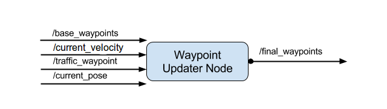

[](https://waffle.io/paulbarna/CarND-Capstone)

## Introduction

This repository contains the results of team [insert name here]'s Capstone project for the Udacity Self-Driving Car Engineer Nanodegree.

The project utilizes Ubuntu Linux 14.04 or 16.04 with Robot Operating System (ROS), the Udacity System Integration Simulator and code written in C++ and Python to provide a System Integration solution to the self-driving car problem.

ROS nodes were implemented in order to achieve a core functionality of the autonomous vehicle system, including traffic light detection, control and waypoint following.

## System Architecture

The following is a system architecture diagram showing the ROS nodes and topics used in the project.

## Nodes

### Waypoint Updater



The purpose of this node is to publish a fixed number of waypoints ahead of the vehicle. It subscribes to the following topics:

* `/base_waypoints` - Publishes a list of all waypoints for the track, which includes waypoints ahead and behind the vehicle. Only published once
* `/current_pose` - Publishes the current position of the car
* `/current_velocity` - Publishes the current velocity of the car
* `/traffic_waypoint` - Traffic light data, position and status

The node will then [publish](http://wiki.ros.org/roscpp/Overview/Publishers%20and%20Subscribers) to the following topic:

* `final_waypoints` - list with a fixed number of waypoints currently ahead of the vehicle with the correct target velocities, depending on traffic lights.

### Drive-by-Wire (DBW)


With the messages being published to `/final_waypoints`, the vehicle's waypoint follower will publish**twist commands** to the `twist_cmd` topic and provide appropriate throttle, brake and steering commands. These commands can then be published to the following topics:

* `/vehicle/throttle_cmd`
* `/vehicle/brake_cmd`
* `/vehicle/steering_cmd`

This node will also subscribe to the `/vehicle/dbw_enabled` topic, which contains the current DBW status, i.e., *Manual* or *Autonomous*. This is in place for situations where the safety driver takes over, and *Autonomous Mode* is disengaged. 

### Traffic Light Detection

## Team Members

|     Name    |      Timezone     |     Slack Handle     |
|-------------|-------------------|------------------|
| Paul Barna <br> (**Team Lead**) | CET | @paulbarna | 
| Diogo Pontes | CET | @diogopontes |
| Ashsish Kejriwal | IST | @ak |
| Xiaoyi Chen | PDT | @xiaoyic |
| Li Wang | PDT | @lwatech |

## Setup and Installation

Please use **one** of the two installation options, either native **or** docker installation.

### Native Installation

* Be sure that your workstation is running Ubuntu 16.04 Xenial Xerus or Ubuntu 14.04 Trusty Tahir. [Ubuntu downloads can be found here](https://www.ubuntu.com/download/desktop).
* If using a Virtual Machine to install Ubuntu, use the following configuration as minimum:
  * 2 CPU
  * 2 GB system memory
  * 25 GB of free hard drive space

  The Udacity provided virtual machine has ROS and Dataspeed DBW already installed, so you can skip the next two steps if you are using this.

* Follow these instructions to install ROS
  * [ROS Kinetic](http://wiki.ros.org/kinetic/Installation/Ubuntu) if you have Ubuntu 16.04.
  * [ROS Indigo](http://wiki.ros.org/indigo/Installation/Ubuntu) if you have Ubuntu 14.04.
* [Dataspeed DBW](https://bitbucket.org/DataspeedInc/dbw_mkz_ros)
  * Use this option to install the SDK on a workstation that already has ROS installed: [One Line SDK Install (binary)](https://bitbucket.org/DataspeedInc/dbw_mkz_ros/src/81e63fcc335d7b64139d7482017d6a97b405e250/ROS_SETUP.md?fileviewer=file-view-default)
* Download the [Udacity Simulator](https://github.com/udacity/CarND-Capstone/releases).

### Docker Installation
[Install Docker](https://docs.docker.com/engine/installation/)

Build the docker container
```bash
docker build . -t capstone
```

Run the docker file
```bash
docker run -p 4567:4567 -v $PWD:/capstone -v /tmp/log:/root/.ros/ --rm -it capstone
```

### Port Forwarding
To set up port forwarding, please refer to the [instructions from term 2](https://classroom.udacity.com/nanodegrees/nd013/parts/40f38239-66b6-46ec-ae68-03afd8a601c8/modules/0949fca6-b379-42af-a919-ee50aa304e6a/lessons/f758c44c-5e40-4e01-93b5-1a82aa4e044f/concepts/16cf4a78-4fc7-49e1-8621-3450ca938b77)

### Usage

1. Clone the project repository
```bash
git clone https://github.com/udacity/CarND-Capstone.git
```

2. Install python dependencies
```bash
cd CarND-Capstone
pip install -r requirements.txt
```
3. Make and run styx
```bash
cd ros
catkin_make
source devel/setup.sh
roslaunch launch/styx.launch
```
4. Run the simulator

### Real world testing
1. Download [training bag](https://s3-us-west-1.amazonaws.com/udacity-selfdrivingcar/traffic_light_bag_file.zip) that was recorded on the Udacity self-driving car.
2. Unzip the file
```bash
unzip traffic_light_bag_file.zip
```
3. Play the bag file
```bash
rosbag play -l traffic_light_bag_file/traffic_light_training.bag
```
4. Launch your project in site mode
```bash
cd CarND-Capstone/ros
roslaunch launch/site.launch
```
5. Confirm that traffic light detection works on real life images
